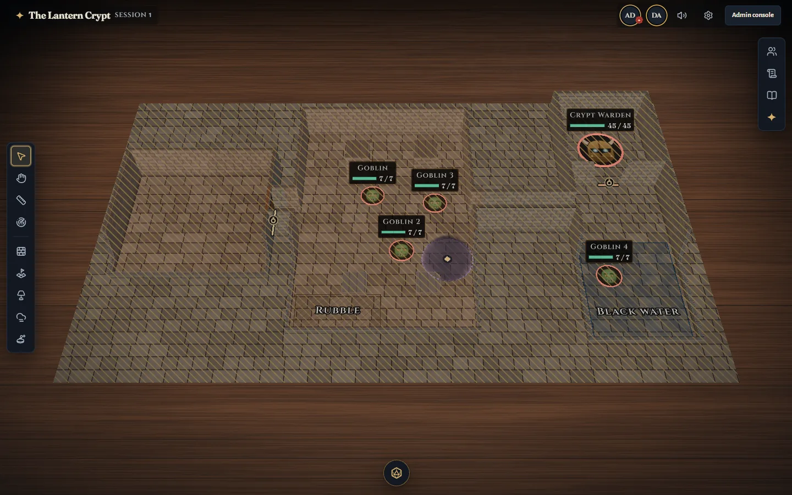
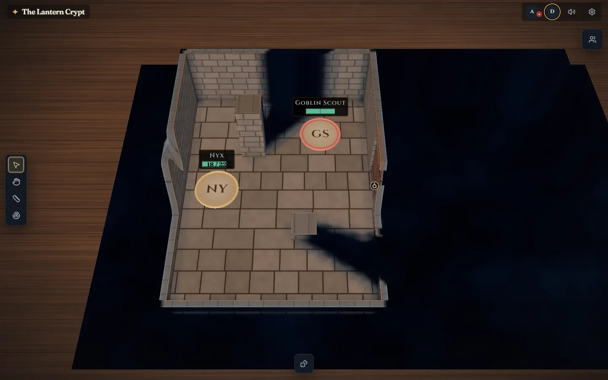
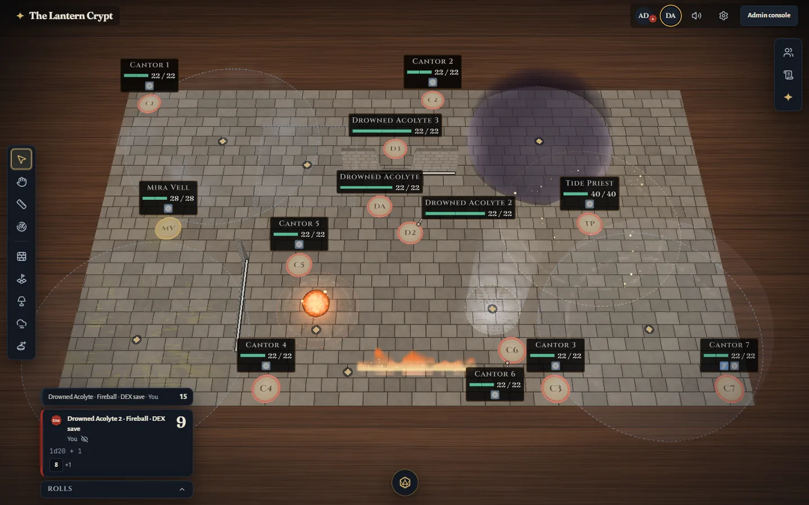
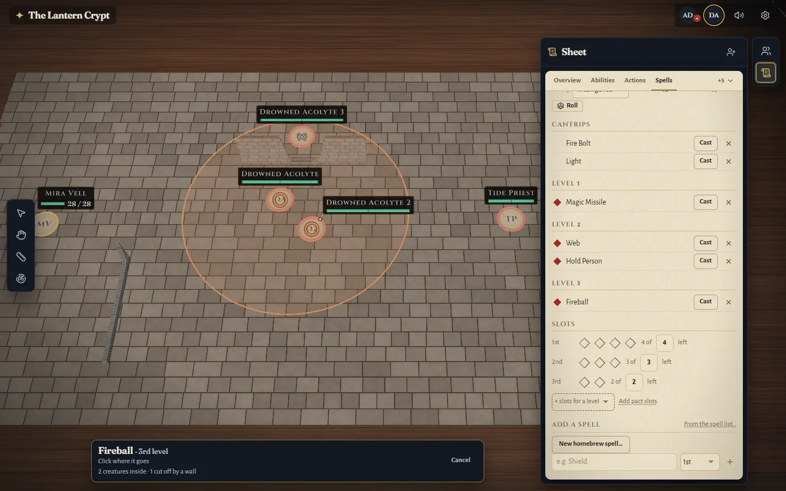
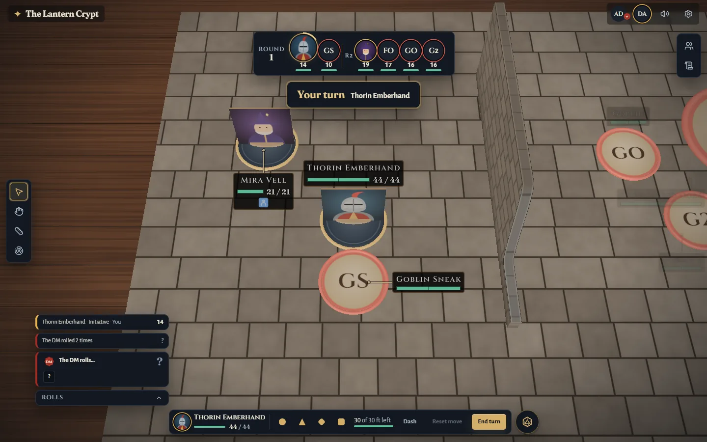
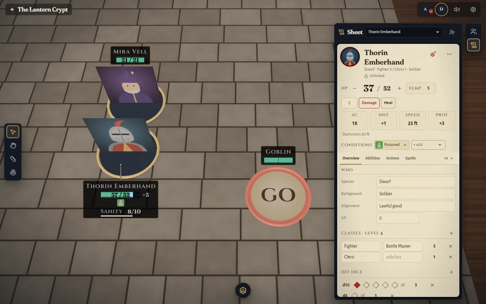
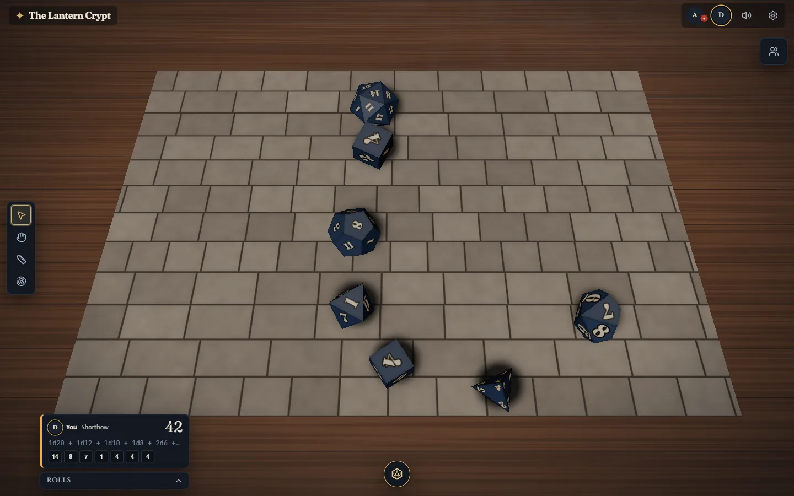
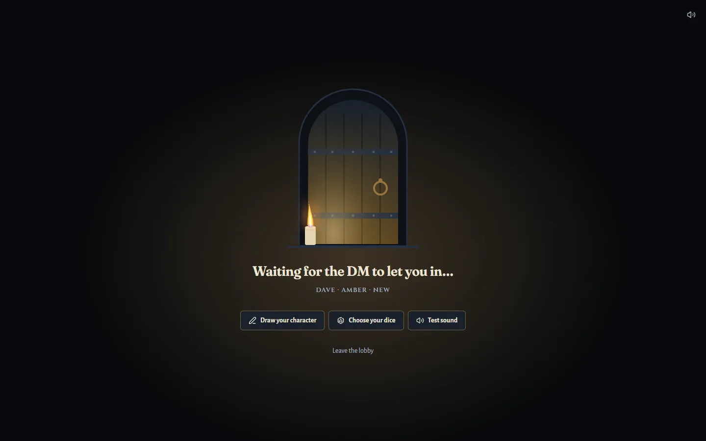

<div align="center">

# ✦ Gloam

**A self-hosted 3D virtual tabletop for fifth-edition fantasy games.**
Run it on your own PC, send your friends a link, and play in the browser — no accounts, no subscriptions, your campaigns stay on your machine.



</div>

## What it does

- **A 3D board you can feel** — walls and doors you open by hand, light that casts real shadows, fog of war, line of sight per creature, difficult ground and water zones.
- **Spells that do something** — all 339 spells of the SRD 5.2.1, with area templates, saves, damage, conditions, concentration and lasting effects, each with its own visual effect.
- **Combat that keeps the book** — initiative tracker, movement budgets with a reach overlay, opportunity-attack hints, death saves, resistances. The DM can always override.
- **Character sheets** — on parchment, with rolls from every number. Import from JSON, or draw your character on the built-in drawing pad.
- **Physics dice** — thrown on the table for everyone to see, in each player's own dice skin.
- **The DM stays in charge** — hidden things never reach players' browsers, every automation can be skipped, and everything can be undone.
- **Players just join** — an invite code, a name, and a waiting room until the DM lets them in. Works on phones too.
- **Music and ambience, handouts, a session journal, emotes** — and a local API so tools like Claude can help you prep.

## A look around

<table>
  <tr>
    <td width="50%"><br><sub><b>Light and vision</b> — torches, darkvision and walls that block sight</sub></td>
    <td width="50%"><br><sub><b>Spells</b> — lasting effects on the board, rolled through resolution cards</sub></td>
  </tr>
  <tr>
    <td><br><sub><b>Casting</b> — aim from the sheet; it knows who's inside and who's behind a wall</sub></td>
    <td><br><sub><b>Combat</b> — initiative, your turn, and how far you can still go</sub></td>
  </tr>
  <tr>
    <td><br><sub><b>Character sheets</b> — HP, conditions and rolls right next to the board</sub></td>
    <td><br><sub><b>Dice</b> — real 3D throws, the total in the feed</sub></td>
  </tr>
</table>

## Getting started

You need **Node.js 24** (22.18 or later works) and **Git**.

```sh
git clone https://github.com/<you>/gloam.git
cd gloam
corepack enable        # gives you the right pnpm
pnpm install
pnpm build
pnpm start
```

The terminal prints the local address — `http://127.0.0.1:4747` — and, the first time, a **one-time setup link**. Open it, choose an admin password, and add the demo campaign, *The Lantern Crypt*, if you'd like something ready to play.

### Inviting your players

Open **Admin → Table → Open table** and choose how people reach you:

| Mode | For | Needs |
|---|---|---|
| **Quick tunnel** | friends anywhere, one-off games | [`cloudflared`](https://developers.cloudflare.com/cloudflare-one/connections/connect-networks/downloads/) |
| **Named tunnel** | a regular group with a stable address | a free Cloudflare account and a domain |
| **LAN** | everyone on your home network | nothing |
| **Local only** | testing on this PC | nothing |

Copy the invite message into your group chat. Each player gets a knock card; admit them and they're at the table.

<div align="center">

<br><sub>Players wait at the door until the DM lets them in — drawing their character or choosing their dice meanwhile.</sub>
</div>

Everything — campaigns, maps, sheets, the log, daily backups — lives in the `data/` folder. Copy it to back up or move your games. The full hosting guide (named tunnels, backups, updating, troubleshooting) is in [docs/HOSTING.md](docs/HOSTING.md).

## Development

```sh
pnpm dev          # server and web app with live reload, on http://127.0.0.1:4747
pnpm check        # typecheck, lint and unit tests
pnpm test:e2e     # browser journeys (Playwright)
pnpm bench        # performance budgets on this machine
```

| Package | What's in it |
|---|---|
| `packages/server` | Node + Colyseus game server, command bus, rules automation, SQLite |
| `packages/web` | React + three.js (React Three Fiber) client: the board, HUD and admin console |
| `packages/shared` | rules, dice, schemas and protocol shared by both |
| `packages/content` | the SRD 5.2.1 content pipeline and packs |
| `packages/mcp` | the MCP server for Claude |

The design lives in [docs/SPEC.md](docs/SPEC.md), with decisions in [docs/DECISIONS.md](docs/DECISIONS.md).

## Credits

This work includes material from the System Reference Document 5.2.1 ("SRD 5.2.1") by Wizards of the Coast LLC, available at https://www.dndbeyond.com/srd. The SRD 5.2.1 is licensed under the Creative Commons Attribution 4.0 International License, available at https://creativecommons.org/licenses/by/4.0/legalcode. See [the pack's attribution](packages/content/packs/srd-5.2.1/ATTRIBUTION.md) for the changes made and the build-time sources.

Fonts — Fraunces, Cinzel, Alegreya Sans and JetBrains Mono — are under the SIL Open Font License. Gloam is an independent project and isn't affiliated with or endorsed by Wizards of the Coast.
